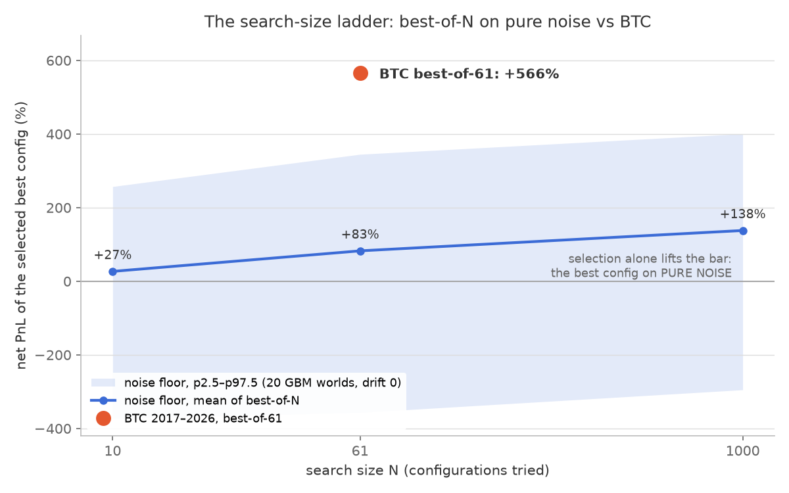

# honesty-harness-toolkit

[](https://zenodo.org/badge/latestdoi/1377207660)
[](https://github.com/RicardoCastellanosTrader/honesty-harness-toolkit/actions/workflows/ci.yml)

A walk-forward backtesting engine plus an experimental-honesty protocol (the
"Honesty Harness"), extracted from the study *Anatomy of a Null Result: A
Pre-registered, Adversarially Audited Case Study of Retail Systematic Trading
in Crypto Perpetuals (2018-2026)* (Castellanos Macias, 2026) and packaged so
that third parties can run their own strategies through the same machinery
that returned a **negative** result to its own author.

*Leer en español: [README_ES.md](README_ES.md).*

## What this is — and what it is not

This toolkit **reduces self-deception; it does not guarantee its absence.**
The technical half (regime walk-forward, bootstrap confidence intervals,
parameter-plateau filters, drift-0 GBM placebo, anti-leakage gates) removes
the *mechanical* ways of fooling yourself. The other half is the **protocol**:
a pre-registration frozen before looking at results, one cardinal metric with
no pivot, an asymmetric falsifier, and a verdict written against the frozen
criteria. Without the second half, the first only produces better-decorated
self-deception.

Honest context: this engine was built for a study that ended in a **negative
result** — 18 strategy families were examined, all negative or sub-threshold,
with the seven principal verdicts meta-audited by 39 independent agents. That
is precisely the credential of the toolkit: it is the machinery that was able
to tell its own author "no".

Provenance: the engine and this toolkit were implemented by AI agents under
the direction of a non-programming domain practitioner, following the Honesty
Harness protocol; the commit history carries the corresponding co-authorship
trailers.

- Study paper: Castellanos Macias, R. (2026), *Anatomy of a Null Result: A
  Pre-registered, Adversarially Audited Case Study of Retail Systematic
  Trading in Crypto Perpetuals (2018-2026)*, SSRN,
  [https://ssrn.com/abstract=7085378](https://ssrn.com/abstract=7085378),
  DOI [10.2139/ssrn.7085378](https://doi.org/10.2139/ssrn.7085378)
- Full study evidence (sealed repository `el-trading-no-existe-evidencia`): DOI [10.5281/zenodo.21229492](https://doi.org/10.5281/zenodo.21229492)
- Honesty Harness protocol: DOI [10.5281/zenodo.21838807](https://doi.org/10.5281/zenodo.21838807)

**This is not investment advice.** Nothing here suggests that trading with
this engine is profitable; the linked evidence suggests the opposite for the
strategy families studied.

## Who it is for

Systematic traders and quantitative-finance students who want to subject a
trading hypothesis to a protocol that can kill it — before the market does —
and researchers interested in pre-registered, adversarially audited
computational studies. Assumes intermediate Python, pandas, and backtesting
basics.
**Python 3.12+** (verified on 3.12.14 and 3.14.3; toy results are
bit-identical across both).

## The two contracts

**Strategy contract (inside the engine).** A strategy is: (1) per-bar
features precomputed as numpy arrays, (2) a configuration universe as
bit-packed integers with a `decode`, (3) a Numba `@jit(parallel=True)` kernel
that iterates configs and returns an `n_configs × 7` matrix of fixed metrics
`[pnl, trades, wins, cancels, max_dd, gross_profit, gross_loss]`, and (4) a
`run_on_slice` wrapper owning warmup and accounting. Meet that contract and
the engine's walk-forward, bootstrap and robustness filters serve you
untouched. `pipelines/toy/` is the minimal example (two-EMA cross, 61
configs); `pipelines/mr/` is the real-scale case (mean reversion, 17 bits,
8,192 configs, five files, zero engine changes).

**Sandbox contract (outside the engine).** If your hypothesis does not fit
the kernel (other frequency, other data, other mechanics), do NOT generalize
the engine: build an isolated sandbox with **zero imports from the core**,
its own loaders, its own control/placebo, and a pre-registration frozen
BEFORE looking at results, whose verdict is written at the end of that same
document. `sandboxes/cs_mom/` and `sandboxes/mfe/` are two real cases from
the study (both negative); `sandboxes/SANDBOX_TEMPLATE/` is the skeleton for
yours.

## Install and run the toy

```bash
pip install -r requirements.txt          # CPU; optional GPU: requirements-cuda.txt

# 1) Synthetic GBM sample (drift 0 — NO edge by construction):
python examples/data/make_synthetic.py

# 2) Toy pipeline on the synthetic series (<2 min on CPU, includes JIT compile):
python pipelines/toy/toy_pipeline.py --data examples/data/TOYGBM1USDT_1h.parquet

# 3) Download ONE real symbol from Binance and repeat:
python pipelines/toy/toy_pipeline.py --symbol BTC/USDT --download

# 4) Regime-free walk-forward (the "answer reciter", portrayed: IS vs forward):
python pipelines/toy/toy_walk_forward.py --symbol BTC/USDT

# 5) The full rite — pre-register → hash → run → verdict against the noise
#    floor (20 GBM worlds, best-of-10/61/1000 search-size ladder):
python examples/toy/placebo_verdict.py --freeze
python examples/toy/placebo_verdict.py --run
```

## The lesson, measured



On pure drift-0 noise, the best-of-61 configurations averaged **+83%** and
the best-of-1000 **+138%** (20 worlds; best-of-61 spread −490% to +379%) —
the bar rises just because you looked more times. On real BTC the best-of-61
scored +566%, above the floor's p97.5 — and, exactly as the pre-registration
predicted, that does **not establish** edge: a drift-0 placebo does not model
BTC's drift. Post-hoc context (not part of the sealed verdict): buy-and-hold
over the same window did +1630%. Accounting note: toy PnL is additive over
notional (a sum of per-trade percentage returns, no compounding and no ruin
stop), which is why values below −100% are possible in these distributions. The walk-forward adds the transfer test: on BTC,
the in-sample winner of each anchor promised +74% on average and delivered
+6.5% forward. The executed, sealed example of the whole rite is
[`examples/toy/PREREGISTRO_TOY.md`](examples/toy/PREREGISTRO_TOY.md)
(sha256 sidecar + OpenTimestamps receipt committed next to it).

To go further — add your own pipeline against the contract, build a sandbox,
read the placebo correctly — see
[`docs/EXTENSION_GUIDE.md`](docs/EXTENSION_GUIDE.md).

## Layout

| Directory | Contents |
|---|---|
| `engine/` | The study's engine, copied without refactor: orchestrator, TF Numba kernel (operational ground truth), optional CUDA, presets/zones, GMM-regime walk-forward, features, downloader, cache, plateau extractor + `placebo_gen.py` and `leakage_gate.py` |
| `presets/` | Execution-preset definitions per symbol (45 CSVs, ~31 per symbol) |
| `pipelines/toy/` | Minimal example pipeline against the contract (EMA cross) |
| `pipelines/mr/` | The study's complete mean-reversion pipeline (exemplary "add a strategy" case); see `KNOWN_DIVERGENCES.md` |
| `sandboxes/` | Real cs_mom and mfe + `SANDBOX_TEMPLATE/` |
| `examples/toy/` | The executed rite: sealed pre-registration, verdict, ladder figure, summary tables |
| `docs/` | Extension guide + pre-registration templates (EN/ES) |
| `tests/` | pytest suite (contract, determinism, leakage gate, W4 defaults) |

The **only** semantic modification relative to the study's engine is
documented and tested: the walk-forward's forward thresholds are explicit
parameters defaulting to 15/1.0 — the values *effectively* used by the study
(see the comment at `_FWD_MIN_TRADES` in `engine/regime_walk_forward.py` and
`tests/test_w4_defaults.py`). The MR pipeline's known divergence (always-on
trailing stop) is documented, not corrected, in
`pipelines/mr/KNOWN_DIVERGENCES.md`.

## What is NOT included

The study's production bot, credentials, candle data (downloader + synthetic
generator included instead), the study's selected production configurations
(specialist_configs), and the study's results — those live, sealed, in the
evidence repository linked above.

## Support

Published **"as is"** under the MIT license. **Bug reports welcome** (issues
with a reproducible case). **No feature requests**: the engine is published
as it was used in the study, without generalizations — that is its
evidentiary value.

## How to cite

See [`CITATION.cff`](CITATION.cff). Toolkit DOI:
[10.5281/zenodo.22846067](https://doi.org/10.5281/zenodo.22846067) (v0.1.0;
concept DOI for all versions:
[10.5281/zenodo.22846066](https://doi.org/10.5281/zenodo.22846066)).
Preferred citation — the study paper:

> Castellanos Macias, R. (2026). *Anatomy of a Null Result: A Pre-registered,
> Adversarially Audited Case Study of Retail Systematic Trading in Crypto
> Perpetuals (2018-2026)*. SSRN. https://ssrn.com/abstract=7085378
> (DOI 10.2139/ssrn.7085378)

Please cite the study evidence (10.5281/zenodo.21229492) and the protocol
(10.5281/zenodo.21838807) alongside the toolkit.
